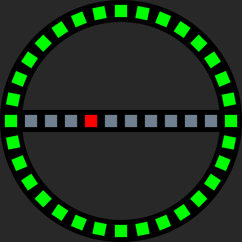
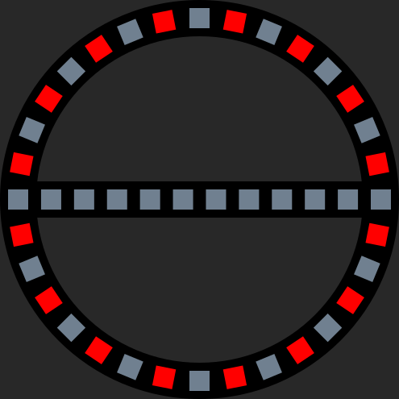
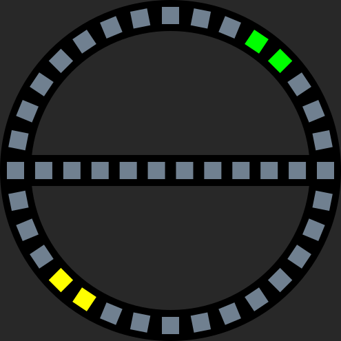
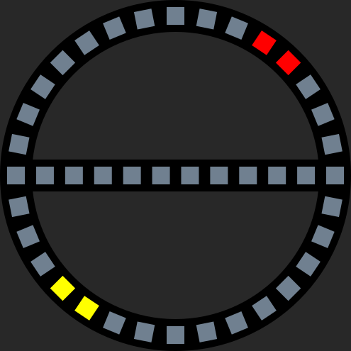

# Stepper-Locking-System_firmware
The C++ firmware for our [Stepper-Locking-System](https://github.com/netz39/Stepper-Locking-System) hardware.

*ToDo: more general description*

## Animations
The system controls two LED-rings with integrated crossbar. Each unit has 42 LEDs. Both rings are visible from inside and outside respectively.
| appearance                                        | description                       | meaning   |
|---------------------------------------------------|-----------------------------------|-----------|
|          | The ring is full with green.      | The door lock is open. You can entrance.         |
|          | The crossbar is full with red.    |  The door lock is closed. You need the locking authorisation to open it.  |
|    | The greens are whirling in the circle. The blue ones represent the progess of the operation. | The door lock is opening. |
|    | The reds are whirling in the circle. The blue ones represent the progess of the operation. | The door lock is closing. |
| | The ring is full with green. In the crossbar a red dot is running back and forth.             | A closing operation is planned but the door wing is stay open. Close it to continue the operation. |
|         | Yellows distributed over the circle are wiggeling back and forth. | A unplanned event occurs. That can be step losses, hall encoder failure or external motor movement. To get the normal state this can be resolved by simply press the open/close buttons.|
|      | Reds distributed over the circle are wiggeling back and forth. | A fatal error occurs. This can be the failure of stepper driver (like no 12V power) or calibration failed. In this mode you can manually drive the motor by pressing the open/close buttons for min. 2 seconds. With normal clicks on buttons you can start the calibration again.           |
|     | Yellows on both sides are wiggeling back and forth. | The calibration procedure is ongoing.        |
|   | Yellows and greens are set opposite. Those are whirling in the circle. | The motor opens the door lock in manual mode by pressing the open button for min. 2 seconds. |
|   | Yellows and reds are set opposite. Those are whirling in the circle.| The motor closes the door lock in manual mode by pressing the close button for min. 2 seconds. |

## Troubleshooting
*ToDo*

## Firmware structure
*ToDo*

## RTOS Tasks
*ToDo*