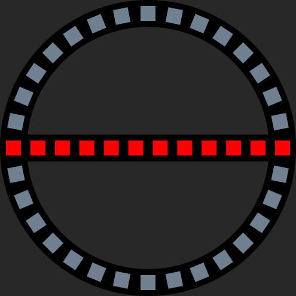
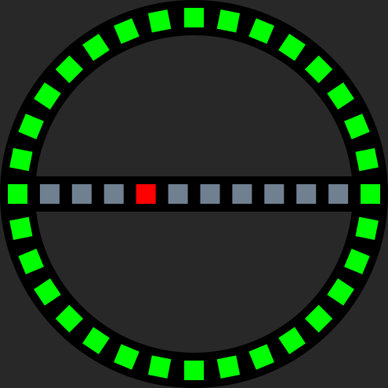
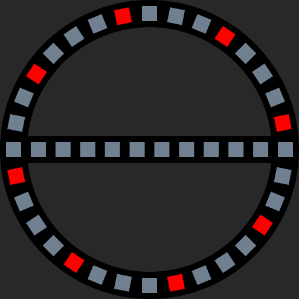

# Stepper-Locking-System_firmware

The C++ firmware for our **[Stepper-Locking-System](https://github.com/netz39/Stepper-Locking-System) hardware**.

An [overview](https://wiki.netz39.de/projects:2022:stepper_locking_system) (German) of this complete project is also available.

On the basis of stepper motor and its driver, the hall encoder and connected switches, the firmware implements a error-tolerant and robust state maschine with overwatchings of current state. At non-planned events like step losses it tries to recover from this.

## Branches

This project currently contains two important branches: 
* `base`
* `legacy_compatibility` (default)

The `base` branch all features necessary for the operation of the locking system.
The `legacy_compatibility` includes additional changes to base branch in order to be able work with the old central system, which is currently used in Netz39.

## How to Compile and Flash
The process of compiling project and flash the binary to microcontroller is described in [compile_flash.md](compile_flash.md).

## Animations
For visualization of current state the system controls two **[LED-rings with integrated crossbar](https://github.com/netz39/LED-ring-with-crossbar)**. Each unit has 42 LEDs. Both rings are visible from inside and outside respectively.

| appearance                                        | description                       | meaning   |
|---------------------------------------------------|-----------------------------------|-----------|
|          | The ring is full with green.      | The door lock is open. You can entrance.         |
|          | The crossbar is full with red.    |  The door lock is closed. You need the locking authorisation to open it.  |
| | The greens are whirling in the circle. The blue ones represent the progess of the operation. | The door lock is opening. |
| | The reds are whirling in the circle. The blue ones represent the progess of the operation. | The door lock is closing. |
| | The ring is full with green. In the crossbar a red dot is running back and forth.             | A closing operation is planned but the door wing is still open. Close it to continue the operation. |
|         | Yellows distributed over the circle are wiggeling back and forth. | A unplanned event occurs. That can be step losses, hall encoder failure or external motor movement. However a normal operation is still possible by simply short press on the open/close buttons.   See [Troubleshooting section](#Troubleshooting) for more details. |
|      | Reds distributed over the circle are wiggeling back and forth. | A fatal error occurs. This can be the failure of stepper driver (like no 12V power) or calibration failed. In this mode you can manually drive the motor by pressing the open/close buttons for min. 2 seconds. With normal clicks on buttons you can start the calibration again.   See [Troubleshooting section](#Troubleshooting) for more details. |
|     | Yellows on both sides are wiggeling back and forth. | The calibration procedure is ongoing.        |
|   | Yellows and greens are set opposite. Those are whirling in the circle. | The motor opens the door lock in manual mode by pressing the open button for min. 2 seconds. |
|   | Yellows and reds are set opposite. Those are whirling in the circle.| The motor closes the door lock in manual mode by pressing the close button for min. 2 seconds. |

## Troubleshooting
In case of unwanted things, the door will give either warning or fatal error.

| animation | meaning |
|-----------| --------|
|  | **warning:**   - step losses   - hall encoder disconnection    - external motor movement  |
|  | **fatal error:**  - step driver disconnection   - calibration failed |

**step losses:**
At opening/closing, too many step losses are detected. Please make sure there are no obstacles and the door wing is closed correctly. Then retry the open/close action.

**hall encoder disconnection:**
There is no connection to hall encoder. This has no impact on opening/closing actions, but there will be no step loss detection anymore. Make sure there is an I²C connection to the hall encoder mounted on the front of stepper motor.

**external motor movement:**
The stepper motor has been moved externally. To get a normal state, simply use the open/close button.

**step driver disconnection:**
Communication to the stepper driver has failed. One of the cause can be a failure of 12V supply. Please check the voltage.

**calibration failed:**
At calibration step losses has occured or the lock switch can not be triggered by the lock bolt. Make sure there are no obstacles and door wing is closed properly. Make also sure that the lock switch is working.

## Firmware structure
This firmware contains the CubeHal and intialization code generated by CubeMX. Both are in "cubemx" folder. The rest is logic code written in C++.

This firmware is designed to work without global variables and so-called "externs" declarations. This is also known as [Dependency injection](https://en.wikipedia.org/wiki/Dependency_injection).
To implement this, an application class is created, from there finally the whole classes with the logic code and also tasks are created.
C-style callbacks from CubeHAL are passed on over the Application class to the relevant class objects as call of its member functions.

With this structure one can clearly understand, which dependencies between the objects exist. This handling is especially important for unit testing.

## RTOS Tasks
RTOS tasks are integrated in classes. These classes derive from a base class, which automatically creates a task when constructing the class. With this a class has to override its member `taskMain` function. After Application class is completely finished with the initializing the tasks will be called.

| classes with RTOS task     | description |
|-------------------|-------------|
| AnalogDigital     | convert analog values to digital (input current, motor temperature) |
| HallEncoder       | polling raw values and calculate an absolute postion |
| LightController   | controls status LED and addressable LEDs  |
| MotorController   | controls stepper motor and overwatch its operation |
| Settings          | load and save settings from/to EEPROM, also notifies classes, which are derived from SettingsUser to get newest parameters |
| StateMachine      | the brain of system - knows to every action a reaction|
| TacticleSwitches  | polling the input of switches/buttons and update state of each button class instances |
